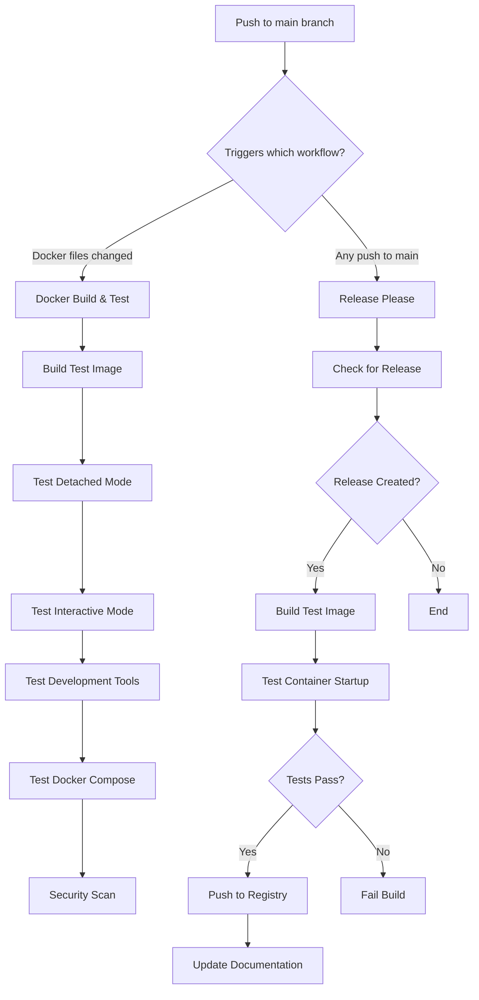

# CI/CD Pipeline Fix Summary

## Issues Identified and Fixed

### 1. Container Startup Issue
**Problem:** Docker container `dev-env` was immediately stopping when run with `docker run --rm -d dev-env`

**Root Cause:** The `start.sh` script ended with `exec su - developer` which switches to the developer user but doesn't maintain a persistent process for detached mode.

**Solution Applied:**
- Modified `start.sh` to use `exec tail -f /dev/null` to keep container running indefinitely
- This maintains SSH service availability while using minimal resources

### 2. CI/CD Pipeline Timing Issue
**Problem:** Release-please workflow was running too early and couldn't push Docker images due to container startup failures

**Root Cause:** The workflow was trying to build and push images without validating that the container actually works in detached mode.

**Solutions Applied:**

#### A. Enhanced Release-Please Workflow
Added container validation steps before pushing to registry:
1. **Test Build Step:** Build image locally first with `load: true`
2. **Container Startup Test:** Verify container runs successfully in detached mode
3. **Conditional Push:** Only push to registry if tests pass

#### B. Improved Docker Build Workflow
Enhanced the existing docker-build.yml with:
1. **Detached Mode Test:** Verify container stays running when launched with `-d` flag
2. **Interactive Mode Test:** Ensure container works for development use cases
3. **Comprehensive Tool Testing:** Validate all development tools are working

## Workflow Execution Order



## Key Improvements

### Container Reliability
- ✅ Container now stays running in detached mode
- ✅ SSH service remains accessible
- ✅ Minimal resource usage with `tail -f /dev/null`

### CI/CD Robustness
- ✅ Pre-validation before registry push
- ✅ Clear failure reporting with container logs
- ✅ Consistent testing across both workflows
- ✅ Prevents broken images from being published

### Testing Coverage
- ✅ Detached mode operation
- ✅ Interactive mode operation
- ✅ Development tool availability
- ✅ User permissions and workspace setup
- ✅ Docker Compose compatibility

## Next Steps

1. **Test the Fix:**
   ```bash
   # Rebuild and test locally
   docker build -t dev-env .
   docker run --rm -d dev-env
   docker ps  # Should show running container
   ```

2. **Trigger CI/CD:**
   - Push changes to main branch
   - Docker Build workflow will validate the fix
   - Future releases will include container validation

3. **Monitor Workflows:**
   - Check GitHub Actions for successful builds
   - Verify containers stay running in CI environment
   - Confirm registry pushes only happen after validation

## Files Modified

- `start.sh` - Fixed container startup for detached mode
- `.github/workflows/release-please.yml` - Added container validation
- `.github/workflows/docker-build.yml` - Enhanced testing coverage
- `CONTAINER_FIX.md` - Container-specific documentation
- `CI_CD_FIX_SUMMARY.md` - This comprehensive summary

The pipeline should now reliably build, test, and publish working Docker images only after validating they function correctly in both detached and interactive modes.
